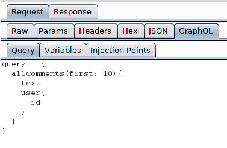
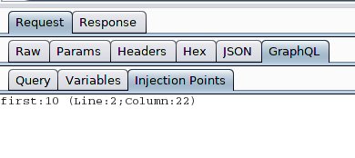

# GraphQL Raider - GQL Burp Extension

## Description
GraphQL Raider is a Burp Suite Extension for testing endpoints implementing GraphQL.

## Features 
### Display and Editor
The gql query and variables are extracted from the unreadable json body and displayed in separate tabs.

While intercepting or resending you can manipulate the gql query and variables inside the gql tab and the message will be correctly send.



### Scanner Insertion Points
Not only the variables are extracted as insertion point for the scanner. Furthermore the values inside the query are also extracted as insertion point for the scanner.

The detected insertion points are displayed for information and better transparency inside the qgl tab of a message


Insertion points are used by active scanner to insert the payloads for detecting vulnerabilities. 
The custom gql insertion points helps the active scanner to position the payloads at the correct place inside of a gql query.

## GraphQL
> GraphQL is a query language for APIs and a runtime for fulfilling those queries with your existing data

https://graphql.org/

### Serving over HTTP
https://graphql.org/learn/serving-over-http/

#### HTTP GET 
GraphQL query should be specified in the "query" query string.

`http://myapi/graphql?query={me{name}}`

#### HTTP POST
JSON-encoded body
```
{
  "query": "...",
  "operationName": "...",
  "variables": { "myVariable": "someValue", ... }
}
```


